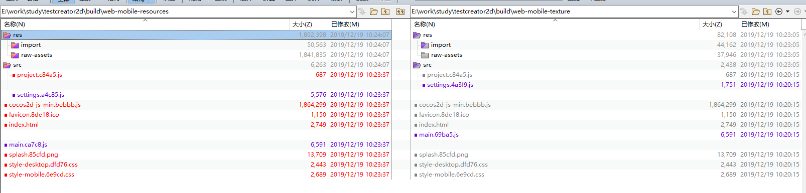

# cocos-creator h5 优化

## 减少文件请求数
编译时合并一些体积小的文件减少http请求
```
1. 把favicon.ico转换为base64编码直接嵌入html文件中，减少一次http请求
2. 把style-mobile.6e9cd.css嵌入html文件，减少一次http请求
3. 把main.js嵌入html减少一次http请求
4. 把settings.7a89c.js嵌入html减少一次http请求
4. 压缩index.html文件

const minify = require('html-minifier').minify;
htmlStr = minify(htmlStr, { removeComments: true, collapseWhitespace: true, minifyJS: true, minifyCSS: true })
fs.writeFileSync(temphtmlPath, Buffer.from(htmlStr))

```
这里个人已写好一套工具，一键编译合并压缩h5导出，有需要联系我

## import文件夹优化,setting.js优化
需要cc.loader.loadRes动态加载的资源，才放在 resources 文件夹或它的子文件夹下
如果一份资源不需要由脚本直接动态加载，那么千万不要放在 resources 文件夹里
因为凡是在resources目录下的文件打包之后都会在import文件夹生成一个json文件。

```
  rawAssets: {
        assets: {
            "af67c4da-5b06-4b58-92b0-9b380044e8f1": [
                "share/cocos.prefab",
                "cc.Prefab"
            ]
        },
        internal: {
            "144c3297-af63-49e8-b8ef-1cfa29b3be28": [
                "effects/builtin-2d-gray-sprite.effect",
                "cc.EffectAsset"
            ],
              "6f801092-0c37-4f30-89ef-c8d960825b36": [
                "materials/builtin-2d-base.mtl",
                "cc.Material"
            ],
        }
    },
```
如上图所示，在resources文件夹下的文件越多，setting.js文件里的assets对象就会越多，导致setting.越大
这里顺便讲解下
## cc.loader.loadRes原理
当要使用cc.loader.loadRes加载资源时，会先去setting.js找到这个目录对于的assets,然后发现这个目录的udid，例如上面的share/cocos.prefab的udid就是af67c4da-5b06-4b58-92b0-9b380044e8f1
找到udid后就会调用cc.loader.load({ 
                type: 'uuid',
                uuid: uuid
            })

然后就会调用CCLoader.js的getResWithUrl,这里就会再调用CCAssetLibrary.js的 cc.AssetLibrary._getAssetInfoInRuntime(udid, _info);这里就会找到这个udid对应的import目录文件夹json,例如上面的af67c4da-5b06-4b58-92b0-9b380044e8f1可以
根据decodeUuid函数反编码为res/import/05/05a04532b.d6487.json这个就描述这个资源对应的文件信息，然后就调用LoadingItems进行加载,这个加载完成后就会回调completeCallback.call(self, errors, items.getContent(id)); ,这里的Items..getContent(id)就是一开始你想加载的东西，顺便cc.loader的_cache会缓存已经加载过的文件

## 资源使用总结
总结一般我是按照
图片放texture文件夹及子目录下，直接引用的prefab不放resources
mp3,需要使用cc.loder.loadRes加载的prefab放resources

一样个数的图片左边是把图片放resources文件夹，右边是把图片放texture大小对比，很明显如果把资源放resources导出的工程是会大很多的


## 减少游戏Drawcall
同一父节点下的子节点之间的渲染顺序遵循ZOrder从小往大的顺序渲染

```
正确
A B B B B C    
```


```
错误
A B B C B C    
```


